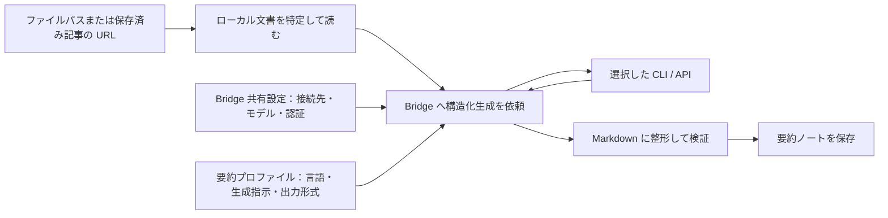

# tkn-doc-summarizer: Tkn Doc Summarizer — ローカル文書を要約ノートにする

ローカルのテキスト文書や、事前に Markdown で保存した Web 記事から、要約・論点・専門用語を整理した Markdown ノートを作る CLI です。
1つの文書の要約、複数ページの記事の統合、複数の記事の比較に使えます。
要約は既定で日本語、設定を変えると英語で作成します。
元の文書への参照と生成条件を記録するため、内容を読み返し、根拠を確認できます。

初めて使う場合は「[セットアップ](#セットアップ)」から「[最初の実行と結果確認](#最初の実行と結果確認)」まで進めてください。
継続して使う場合は「[日常利用と再実行](#日常利用と再実行)」、目的から操作を探す場合は「[コマンド一覧](#コマンド一覧)」を参照してください。

## 得られるノートと対象範囲

次は、バックアップを説明する架空の記事から作る要約ノートの本文例です。
実際の生成結果ではなく、構成を示すために一部の節を抜粋しています。

```markdown
# バックアップと復元確認

## 1. 要約

記事では、バックアップを保存するだけでなく、必要なファイルを復元できることを確認する重要性を説明しています。

## 3. 重要ポイント

- 保存の成功と復元の成功は別に確認します。
- 復元する対象と手順を決め、定期的に試します。

## 5. 結論

バックアップの目的は、失ったデータを必要なときに戻せるようにすることです。
保存と復元確認を組み合わせることで、その目的を確かめられます。
```

単一文書と連続ページの要約は「要約 → 構造化（抽象から具体へ）→ 重要ポイント → 専門用語 → 結論」の順に並びます。
比較では「比較要約 → 共通概念 → 観点別の捉え方 → 相違・対立 → 各ソース固有の知見 → 専門用語 → 結論」を作り、主張に `[S1, S2]` のような出典 ID を付けます。

| やりたいこと                            | 入力                                                  | 使うコマンド                               |
| --------------------------------------- | ----------------------------------------------------- | ------------------------------------------ |
| 1つの文書を要約する                     | UTF-8 のテキストファイル1件、または保存済み記事の URL | `summarize`                              |
| 連続するページを1つの記事としてまとめる | ページ順に並べた2件以上の文書                         | `synthesize`（既定は `--mode series`） |
| 独立した記事の共通点や違いを整理する    | 比較する2件以上の文書                                 | `synthesize --mode compare`              |

URL は、保存済み Markdown を探す検索キーです。
本 CLI は Web ページを取得しないため、URL を指定する場合は Obsidian Web Clipper などで本文を保存しておきます。
元の文書は読み取り専用で扱い、複製・編集・移動・削除せず、別の要約ノートを作ります。

### 処理の流れ

矢印はデータの流れです。
CLI が入力の特定、生成の依頼、検証、保存を順に行い、生成AIへの接続は共通ライブラリ [tkn_genai_bridge](https://github.com/tuckn/tkn_genai_bridge)（以下、Bridge）が担当します。



要約プロファイルは、言語・生成指示・出力形式をまとめた設定です。
`default-ja` は日本語、`default-en` は英語を選びます。
生成に使う接続先・モデルは Bridge の共有設定で指定し、アプリの `generation.profiles` から参照します。
要約ノートのほかに、成功・失敗や生成条件を記録した JSON の実行レポートを保存します。

## セットアップ

### 必要なもの

- Python 3.11 以上と [uv](https://docs.astral.sh/uv/)。
- 要約する UTF-8 のテキスト文書と、要約を書き込める保存先。
- 要約に使う CLI または API の利用準備。既定は認証済みの Codex CLI です。

主対象は Windows 11 です。
以下のコマンドはターミナルで実行し、Windows 形式の例示パスを実際のパスに置き換えてください。
他の OS での実動作は未検証です。

### インストールする

リポジトリを置いたフォルダへ移動してインストールします。

```shell
cd "C:\path\to\tkn_doc_summarizer"
uv tool install .
tkn-doc-summarizer --help
tkn-doc-summarizer --version
```

`--help` でコマンド一覧、`--version` でインストール済みのバージョンを確認できます。
更新後の反映方法は「[CLI を更新する](#cli-を更新する)」を参照してください。

### 設定ファイルを作成する

```shell
tkn-doc-summarizer config init
```

このコマンドにより、`~/.tkn/doc_summarizer/config.yaml` を作成し、結果の `status` と絶対パス `path` を JSON で表示します。
`~` は実行ユーザーのホームフォルダを示しています。Windows の場合、`C:\Users\<User Name>`です。 同じ内容のファイルがあれば `unchanged` となり、編集済みのファイルがあれば上書きせず停止します。
すでに設定済みの場合は、そのファイルを使って次へ進めます。

### 共有設定と生成プロファイルを確認する

接続先・モデル・認証は `~/.tkn/genai_bridge/config.yaml` にまとめます。
共有設定がない場合も、組み込みの `codex-default` を利用できます。
以下は共有設定の最小例です。既存の共有設定がある場合は、使用するプロファイルを選んでください。

```yaml
schema_version: "1.1.0"
default_profile: codex-default
profiles:
  codex-default:
    provider: codex
    model: null
    timeout_seconds: 1800
```

本 CLI の `config.yaml` は、共有設定を次のように参照します。
保存先や `summary_prompt` など、ほかの設定は保持してください。

```yaml
schema_version: "1.0.0"
generation:
  summary_profile: default-ja
  active_profile: codex
  profiles:
    codex:
      bridge_profile: codex-default
```

`codex` はアプリ内の選択名、`codex-default` は Bridge の共有設定内の名前です。
`generation.summary_profile` は言語・出力形式を選び、接続先とは独立しています。
Bridge は作業フォルダの `./.tkn/config.yaml` を読み込まないため、アプリの設定と混同されません。

### 保存先を設定して確認する

ファイルパスを直接指定し、既定の保存先を使う場合は、設定を編集せずに始められます。
要約は `~/.tkn/doc_summarizer/data/summaries/`、実行レポートは `~/.tkn/doc_summarizer/state/reports/` に保存します。

保存先を変える場合は、`config init` が表示したファイルで次の項目を変更します。
以下は設定の一部であり、ほかの項目は残してください。
例示パスは実際の保存先に置き換えます。

```yaml
output_root: 'C:\path\to\summaries'
reports_root: 'C:\path\to\reports'
```

URL を入力する場合は、同じ設定ファイルの `source_roots` を Markdown の保存先に変更します。
`config init` が作る設定には例示パスが入っているので、そのまま URL 検索に使わないでください。
ファイルパスを直接指定する場合、この項目は使いません。

```yaml
source_roots:
  - 'C:\path\to\web-clips'
```

編集後に有効な設定を確認します。

```shell
tkn-doc-summarizer config show
```

JSON の `values` で保存先・生成プロファイル、`value_sources` で各値を決めた設定元を確認できます。
`generationResolved` には共有設定から解決した接続先・モデル・待機上限・推論設定が表示されます。
`config show` は外部 CLI の起動・認証・通信・ファイル作成を行いません。
設定の優先順位と全項目は「[設定](#設定)」にあります。

## 最初の実行と結果確認

### 入力と保存予定先を確認する

`<source-file>` は、要約する UTF-8 の Markdown またはテキストファイルの実際のパスに置き換えます。
まず `--dry-run` で、入力が読めることと保存予定先を確認します。

```shell
tkn-doc-summarizer summarize "<source-file>" --dry-run
```

新規作成予定なら `status: "planned"` と `path` を表示します。
`--dry-run` は Bridge の `plan()` で接続設定・入力・スキーマを確認し、`details.bridge_plan` に入力ハッシュと token 概算を表示します。
外部 CLI の起動・認証・通信を行わず、要約・レポート・一時ファイルを作成しません。
認証や生成品質までは確認しないため、成功しても実際の生成が成功することを保証しません。

### 要約を作成する

通常実行では、文書の本文とタイトル・出典などを Bridge で選択した接続先へ渡して生成します。
利用形態に応じて利用枠や費用を消費します。
その接続先へ渡せる文書を指定してください。

```shell
tkn-doc-summarizer summarize "<source-file>"
```

生成結果を Markdown に整形し、形式を検証してから保存します。
処理の進捗に続いて、標準出力へ結果の JSON を1件表示します。
次は新規作成時の結果の一部を示す説明例です。

```json
{
  "status": "created",
  "path": "C:\\path\\to\\summaries\\2026\\20260921_バックアップ_default-ja_d5e2d465.md",
  "report_path": "C:\\path\\to\\reports\\20260926T120000+0900_1234abcd.json"
}
```

`status` が `created` または `updated` なら、`path` の要約ノートをエディターや Obsidian で開きます。
既存の要約を再利用した場合は `unchanged` です。
自動検証は構造と出典の一致を確認しますが、要約の意味や事実関係は元の文書と照合してください。
生成直後の確認状態は `reviewStatus: unreviewed` です。

保存後に形式と出典を再確認する場合は、`<summary-note>` を結果の `path` に置き換えて実行します。
この検査は保存時にも自動で行うため、初回実行に必須の追加操作ではありません。

```shell
tkn-doc-summarizer validate "<summary-note>"
```

`valid: true` なら検証成功です。
失敗した場合は `errors` を確認します。
終了コードとレポートの読み方は「[表示と実行レポート](#表示と実行レポート)」を参照してください。

## 日常利用と再実行

### 保存済み記事を URL で指定する

`source_roots` に設定したフォルダを再帰的に検索します。
入力 Markdown の Frontmatter（文書先頭の YAML メタデータ）には、次のように元記事の `url` を記録してください。
以下は先頭部分の例で、要約対象の本文がこの後に必要です。

```yaml
---
title: バックアップと復元確認
url: https://example.com/article
---
```

```shell
tkn-doc-summarizer summarize "https://example.com/article"
```

例の URL は実際の記事 URL に置き換えます。
一致する文書が1件なら要約し、0件または複数件なら停止します。
URL のフラグメントや `utm_` で始まる追跡パラメーターなどを除いて照合します。
自動生成ノートなど `cliptool: Codex` を持つ Markdown は検索対象から除きます。
一致しない場合は保存内容を確認するか、ファイルパスを直接指定してください。

### 連続ページを1つにまとめる

`<page-1>` と `<page-2>` を、ページ順に並べた文書のパスまたは保存済み記事の URL に置き換えます。
3件以上ある場合も、同じように後ろへ追加します。

```shell
tkn-doc-summarizer synthesize "<page-1>" "<page-2>"
```

既定の `series` モードは、連続するページを1つの記事として要約します。
ページ順は引数の順序で決まり、ファイル名や URL から推測しません。
生成指示では、ページ共通の重複を省きながら、ページをまたぐ論旨や後半の条件を保持するよう求めます。
同じローカルファイルを重複して指定すると停止します。

### 独立した記事を比較する

`<article-a>` と `<article-b>` を、比較したい文書のパスまたは保存済み記事の URL に置き換えます。

```shell
tkn-doc-summarizer synthesize "<article-a>" "<article-b>" --mode compare
```

記事に `S1`、`S2`…の出典 ID を付け、共通概念、異なる観点、相違・対立を整理します。
引数の順序は ID を決めるもので、権威・優先順位・時系列を意味しません。
生成指示では、根拠のない対立を作らないよう求めます。
比較モードはカスタムプロンプトを受け付けないため、`summary_prompt` は `null` にしてください。

両モードとも、`--title "<title>"` でタイトルを指定できます。
省略すると、統合・比較した全体の内容から生成AIがタイトルを決めます。
新規ノートを自動命名する `--dry-run` では、先頭文書のタイトルを使った暫定パスを返し、`details.generated_title_pending` が `true` になります。
実際の保存先は生成タイトルに応じて決まります。

### 言語や保存先を変更する

同じ文書の英語版を作る場合は、この実行だけ要約プロファイルを変更できます。
日本語版と英語版は別ノートとして共存します。

```shell
tkn-doc-summarizer summarize "<source-file>" --summary-profile default-en
```

特定のファイルに保存する場合は、`<output-file>` に `.md` で終わるパスを指定します。

```shell
tkn-doc-summarizer summarize "<source-file>" --output "<output-file>"
```

保存先フォルダだけを変えて自動命名を使う場合は `--output-root "<output-directory>"` を指定します。
同じオプションは `synthesize` でも使えます。

### 既存ノートを再生成する

通常は同じコマンドを再実行すると、入力・生成条件・保存済みノートの検証結果に応じて次のように動作します。

| 既存ノートの状態                                                         | 通常実行の動作                                   |
| ------------------------------------------------------------------------ | ------------------------------------------------ |
| 対応するノートがない                                                     | Bridge 経由で生成して新規作成                    |
| 入力と生成条件が一致し、検証にも成功                                     | `unchanged` として再利用。AI は呼び出さない    |
| 入力、プロンプト、出力形式、明示したモデルなどが変わった                 | 上書きせず停止。再生成には`--overwrite` が必要 |
| 対応するノートが検証に失敗                                               | 自動では置換せず停止                             |
| 指定先が別の文書・文書の組・モード・プロファイル・プロンプト ID に属する | `--overwrite` を付けても置換せず停止           |
| 同じ識別情報のノートが複数ある                                           | どれかを暗黙に選ばず停止                         |

再生成する場合は、必要な編集内容を別に保存してから実行します。
**`--overwrite` は手動編集や確認済みの内容も置き換え、`reviewStatus` を `unreviewed` に戻します。**
要約ノートの自動バックアップは作りません。
先に保存予定先と更新予定を確認できます。

```shell
tkn-doc-summarizer summarize "<source-file>" --overwrite --dry-run
tkn-doc-summarizer summarize "<source-file>" --overwrite
```

`synthesize` でも同じ指定が使えます。
入力や生成条件が一致していても、`--overwrite` を付けると再生成します。
同じノートを更新するときは `noteId` と作成日時 `date` を保持し、`updated` を更新します。

### 失敗や中断からやり直す

失敗したら、エラーに表示された理由と、レポートのパスがある場合はその JSON を確認します。
入力や認証、保存先などの原因を直し、同じコマンドを再実行してください。
途中の生成結果を再開する機能はなく、完成したノートが再利用できなければ生成をやり直します。

要約は全体を組み立て、検証してから保存先のファイルを置き換えます。
ただし、保存後の再検証やレポート保存で失敗すると、要約ノートだけが残る場合があります。
中断後にノートが存在する場合は `validate` で確認してから再実行してください。

## コマンド一覧

| 目的                     | コマンド・主なオプション                          | 詳細                                         |
| ------------------------ | ------------------------------------------------- | -------------------------------------------- |
| 使い方・版を確認         | `--help` / `--version`                        | [インストール](#インストールする)             |
| 1文書を要約              | `summarize SOURCE`                              | [最初の実行](#最初の実行と結果確認)           |
| 連続ページを統合         | `synthesize SOURCE SOURCE [...]`                | [連続ページ](#連続ページを1つにまとめる)      |
| 独立した文書を比較       | `synthesize SOURCE SOURCE [...] --mode compare` | [記事の比較](#独立した記事を比較する)         |
| 保存済みノートを検証     | `validate PATH`                                 | [互換性と検証](#保存済みノートの互換性と検証) |
| ユーザー設定を作成       | `config init`                                   | [設定ファイルの作成](#設定ファイルを作成する) |
| 有効な設定と決定元を確認 | `config show`                                   | [設定](#設定)                                 |
| 設定を初期状態へ戻す     | `config init --force`                           | [設定の初期化](#設定を初期状態へ戻す)         |
| 編集用の生成指示を作成   | `prompt init [NAME]`                            | [カスタムプロンプト](#生成指示を調整する)     |

表のコマンドの前に `tkn-doc-summarizer` を付けて実行します。
各コマンドの全オプションは、例えば `tkn-doc-summarizer summarize --help` で確認できます。

### 共通オプションと書き込み範囲

`summarize`、`synthesize`、`config show` の設定上書きは、コマンド名の後ろに指定します。
`--source-root` は複数回指定でき、設定ファイルの検索先一覧を置き換えます。
`--model`、`--config`、`--reports-root`、入力サイズやタイムアウトの指定も、この実行にだけ適用します。

| 操作                                                        | AI の実行 | この CLI が保存するもの                                    |
| ----------------------------------------------------------- | --------- | ---------------------------------------------------------- |
| `summarize` / `synthesize` の新規作成・再生成           | あり      | 要約ノート、実行レポート                                   |
| 同コマンドで`unchanged`                                   | なし      | 実行レポート                                               |
| 同コマンドの`--dry-run`                                   | なし      | なし                                                       |
| `validate` / `config show` / `--help` / `--version` | なし      | なし                                                       |
| `config init`                                             | なし      | 設定ファイル。`--force` による置換時はバックアップも作成 |
| `prompt init`                                             | なし      | 編集用プロンプト                                           |

`--dry-run` は要約・統合コマンドに対応します。
設定、プロンプト、入力、出力先の衝突や既存ノートを検査し、Bridge の設定と要求形式を検証します。書き込みや外部 CLI の起動確認・認証・通信は行いません。
既存ノートが有効なら `unchanged` を返し、通常実行でも上書きが必要な場合は dry-run でも停止します。

## 設定

### 優先順位とパス

設定は次の順に読み、後の値が前の値を上書きします。

1. 組み込みの既定値。
2. ユーザー設定 `~/.tkn/doc_summarizer/config.yaml`。
3. 実行時の作業フォルダにある `./.tkn/config.yaml`。
4. `--config FILE` で明示した YAML ファイル。
5. 個別のコマンドラインオプション。

`./.tkn/config.yaml` は作業フォルダ内だけで設定を変えるためのファイルで、このリポジトリでは Git 管理対象外です。
通常の相対パスは設定ファイルの場所ではなく、実行時の作業フォルダを基準に解決します。
`summary_prompt` は例外で、ファイル名だけを指定すると専用のプロンプト保存先から読みます。

以下の表は組み込みの既定値です。
`config init` の [設定例](src/doc_summarizer/resources/config.example.yaml) には、URL 検索先として置換用の例示パスが入っています。
設定を省略した場合は、それより優先順位の低い設定値または既定値を使います。

| 設定キー                                     | 既定値                                   | 変えるとどうなるか                                                       |
| -------------------------------------------- | ---------------------------------------- | ------------------------------------------------------------------------ |
| `source_roots`                             | `[]`                                   | URL で検索する Markdown の保存先一覧。空なら URL 検索はできない          |
| `output_root`                              | `~/.tkn/doc_summarizer/data/summaries` | 自動命名した要約の保存先と既存ノートの検索先が変わる                     |
| `reports_root`                             | `~/.tkn/doc_summarizer/state/reports`  | 実行レポートの保存先が変わる                                             |
| `schema_version`                           | `"1.0.0"`                              | アプリの設定形式の版。Bridge やノートの版とは別                          |
| `generation.active_profile`                | `codex`                                | アプリ内の生成プロファイルを選ぶ                                         |
| `generation.profiles.codex.bridge_profile` | `codex-default`                        | Bridge 共有設定の参照先                                                  |
| `generation.profiles.<name>.overrides`     | `{}`                                   | このアプリで使う接続設定の上書き。共有ファイルは変更しない               |
| `max_input_bytes`                          | `2000000`                              | 入力1ファイルの上限バイト数。Frontmatter を含むファイル全体が対象。1以上 |
| `max_total_input_bytes`                    | `8000000`                              | 1回の`synthesize` で読む全入力ファイルの合計上限バイト数。1以上        |
| `source_path_format`                       | `native`                               | 出力する出典参照を OS のパスにする。`file-uri` も指定可能              |
| `generation.summary_profile`               | `default-ja`                           | 要約の言語・構成を選ぶ。`default-ja` または `default-en`             |
| `summary_prompt`                           | `null`                                 | 組み込み指示を使用。ファイル名または絶対パスでカスタム指示を選ぶ         |

`source_roots` はリストで指定し、明示した `[]` は下位設定の一覧を空にします。
`summary_prompt` や Bridge の `model` の `null` は、空文字ではなく YAML の `null` を使ってください。
未知の設定キー、型・範囲が不正な値、存在しない `--config`、読み込めないプロンプトはエラーになります。
選択した接続先と上書き値は `config show`、生成予定の `--dry-run`、通常生成時に Bridge が検証します。

`output_root` を変更すると以前の保存先のノートを検索しなくなるため、新しい保存先では再生成されることがあります。
既存ノートの再利用判定は従来の入力・要約リソース・明示したモデルの照合を保持します。
アプリの `overrides.model` または `--model` を明示した場合は、接続先の表示名とモデルを `generator` と比較します。
それ以外では、共有設定内のモデル・接続先・推論設定の変更だけで既存ノートを再生成しません。
新しい接続条件で再生成する場合は `--overwrite` を使います。既存ノートを再利用でき、モデル上書きもない場合は Bridge の設定読み込みを省略します。

### 生成プロファイルと共有設定

共有設定に `claude-default` を定義した場合のアプリ設定例です。
モデル・認証・実行ファイル・`local_only` の指定は [Bridge の設定仕様](https://github.com/tuckn/tkn_genai_bridge/blob/9cf534e47159901c3bb05bb802695fad746cc338/docs/reference/configuration.md) に従います。

```yaml
generation:
  summary_profile: default-ja
  active_profile: codex
  profiles:
    codex:
      bridge_profile: codex-default
    claude:
      bridge_profile: claude-default
    codex-long:
      bridge_profile: codex-default
      overrides:
        timeout_seconds: 1800
```

```shell
tkn-doc-summarizer config show --profile claude
tkn-doc-summarizer summarize "<source-file>" --profile claude --dry-run
tkn-doc-summarizer synthesize "<source-1>" "<source-2>" --mode compare --profile claude
```

`--profile` はアプリ内の名前、`--bridge-profile` は共有設定の名前をこの実行だけ変更します。
`--model`、`--provider-timeout-seconds` は選択した接続設定を上書きします。
待機上限の既定値は共有設定から継承します。Bridge の組み込み値は300秒で、指定できる範囲は0より大きく86400以下です。
`overrides` は Bridge の `Profile` の規則で検証され、存在しないプロファイルや不正な値で別の接続先へ自動的に切り替えることはありません。
アプリ内の設定はプロファイル単位・項目単位で再帰的にマージします。

旧形式のトップレベル `summary_profile`、`model`、`provider: codex`、`codex_executable`、`codex_timeout_seconds` は読み込み時に変換します。
旧形式と `generation` を同じ設定ファイルで混在させるとエラーになります。
旧 `provider` / `codex_executable` を残した場合は Codex 接続に限定されるため、別の接続先へ移行するときは `generation` 形式に揃えてください。
旧 `--codex-executable` / `--codex-timeout-seconds` も互換入力として受け付けます。既存のユーザー設定ファイルを自動で書き換えることはありません。

### 出典のパス形式を変更する

要約ノートの Frontmatter には、元の文書への参照を記録します。
既定の `native` は Windows では次のような形式です。
以下は生成ノートの抜粋で、設定ファイルではありません。

```yaml
source: 'C:\path\to\article.md'
```

URI 形式にするには、`config.yaml` の `source_path_format` を変更します。

```yaml
source_path_format: file-uri
```

この場合の出力は `source: "file:///C:/path/to/article.md"` です。
複数文書では `sources` の各項目に同じ形式を使います。
既存ノートは両形式を読み取り・検証できますが、設定を変えただけでは保存済みノートを書き換えません。
形式を変更するには、手動編集も置き換えることを確認したうえで `--overwrite` により再生成します。

### 生成指示を調整する

組み込みプロンプトの編集用コピーを作成します。
`NAME` を省略すると `summary.md` です。

```shell
tkn-doc-summarizer prompt init my-summary.md
```

`~/.tkn/doc_summarizer/prompts/my-summary.md` に、新しい UUID を付けたプロンプトを保存します。
既存ファイルは置換せず、CLI の設定も自動では変えません。
英語版を基にする場合は `prompt init my-english-summary.md --summary-profile default-en` を指定します。

作成されたファイルは UTF-8 の Markdown です。
先頭の `type: prompt`、UUID の `id`、文字列の `version` を保持し、本文の生成指示を編集します。
次に、`config.yaml` の同名項目を変更して使います。

```yaml
summary_prompt: my-summary.md
```

1回だけ使う場合は `--summary-prompt my-summary.md` を指定します。
別の場所のプロンプトには絶対パスを指定してください。
相対フォルダを含むパスは指定できません。

カスタムプロンプトは `summarize` と `series` で使え、選んだプロファイルの生成指示だけを置き換えます。
JSON の出力形式と Markdown のテンプレートはそのまま使うため、それらに合う指示を記述してください。
比較モードでは組み込みの比較用プロファイルを一体で使います。
入力本文を指示として扱わないための区切りと注意文は、カスタム指示の外側でアプリケーションが付けます。

## 保存されるものと形式

### 保存先と保持するデータ

既定の配置は次のとおりです。

```text
~/.tkn/doc_summarizer/
├── config.yaml
├── data/
│   └── summaries/<year>/<date>_<title>_<profile>_<prompt-id-prefix>.md
├── prompts/
└── state/
    └── reports/<run-id>.json
```

| 保存するもの             | 役割と保持する理由                                                               |
| ------------------------ | -------------------------------------------------------------------------------- |
| 要約ノート               | 読み返すための成果物。手動編集や確認状態も含むので、再生成前に必要な版を保持する |
| 元の文書                 | 検証と再生成に必要。本 CLI は原本のコピーを保存しないため、入力元で保持する      |
| 設定とカスタムプロンプト | 保存先・生成条件を再現するために保持する                                         |
| 実行レポート             | 成功・失敗、処理時刻、生成条件を調べる記録。削除するとその実行記録は失われる     |

ノートは元文書と生成環境があれば再生成できますが、再び生成AIの利用が必要になり、同じ文章や手動編集は再現されません。
生成用の外部プロセス・API・一時ファイルの管理は Bridge が担当します。
ノートは保存先と同じフォルダで一時ファイルを準備してから置き換えます。

### ファイル名と既存ノートの識別

自動ファイル名の日付は、元文書の `published` または `date`、ファイル名先頭の年月日、実行日の順で決めます。
複数文書の場合は、先頭文書の日付を基準とし、ファイル名に文書の組を識別する ID の一部も加えます。
ファイル名に使えない文字は置き換え、長いタイトルは短縮します。

既存ノートは `output_root` 配下を再帰的に検索し、単一文書では出典のパス・要約プロファイル・プロンプト ID で識別します。
複数文書では、モードと順序付きの出典パスから作る `sourceSetId`、要約プロファイル、プロンプト ID を使います。
同じ保存先の中で要約の名前や場所を変えても、識別情報があれば現在のパスを使えます。
入力文書の移動や複数文書の並べ替えは識別情報を変えるため、同じノートの更新として扱われない場合があります。

### 本文とメタデータ

単一文書・連続ページの日本語プロファイルは、1段落で約250〜400字の要約を求めます。
英語プロファイルは約120〜200語を目安とし、見出しは `Summary`、`Structuring (from abstract to concrete)`、`Key points`、`Technical terms`、`Conclusion` です。
構造化の節は大分類の H3、必要に応じた中分類の H4 と箇条書きで整理します。
重要ポイントは5〜8件、専門用語は中立的で再利用可能な定義3〜7件を目安とします。
これらは生成指示上の目安で、原文の量や内容によって変わります。
`cover` がある入力では、タイトル直下にその画像参照を表示します。

ノート先頭の Frontmatter には、次のような情報を記録します。

| 情報             | 主な項目と用途                                                                              |
| ---------------- | ------------------------------------------------------------------------------------------- |
| ノートの種類と版 | `type: summary`、`schemaVersion`。検証規則を選ぶ                                        |
| 出典             | `source` / `sources`、`sourceSha256`。元文書と変更の有無を確かめる                    |
| 複数文書の構成   | `synthesisMode`、`sourceSetId`、`sourceSetSha256`。順序付きの文書の組と内容を記録する |
| 生成条件         | `generator`、プロンプト・プロファイル・出力スキーマ・テンプレートの ID、版、SHA-256 など  |
| 確認状態と識別   | `reviewStatus`、`noteId`、`date`、`updated`                                         |

SHA-256 は、内容が変わったかを照合するためのハッシュ値です。
モデル名は取得できた場合に `generator` へ含めます。
`schemaVersion: "5.0"` や `promptVersion: "3.0"` のような版は、小数ではなく識別子として文字列で保存します。
原文全体や分類用の `nouns` は生成ノートへ追加しません。

`reviewStatus` に使える値は `unreviewed`、`pending`、`reviewing`、`accepted`、`needs-revision`、`rejected` です。
内容を確認した後は、運用に合わせて変更してください。
確認状態を変更しても、明示的な `--overwrite` による再生成は防ぎません。

### 表示と実行レポート

進捗と診断は標準エラー出力に表示し、通常の成功結果は標準出力に JSON を1件返します。
`--help` と `--version` はテキスト表示です。

| 表示・結果                            | 意味と確認すること                                                |
| ------------------------------------- | ----------------------------------------------------------------- |
| `status: "planned"`                 | dry-run の計画。`path` と `details.planned_status` を確認する |
| `status: "created"` / `"updated"` | 要約の新規作成・更新。`path` を開く                             |
| `status: "unchanged"`               | 既存ノートを再利用した                                            |
| `report_path`                       | この実行の JSON レポートの保存先。dry-run では`null`            |
| `details.validated`                 | 保存済みノートの検証結果。生成内容の正しさを保証する値ではない    |
| `[ERROR]`                           | 処理失敗。理由と、表示があれば`report=...` の保存先を確認する   |

要約・統合の通常実行では、再利用した場合もレポートを作ります。
レポートの `status` は `success` または `failure` で、ノートを作成したかどうかは `result.status` で確認します。
失敗時は `error` を読みます。
レポート形式1.1では、生成成功時の `result.details.generation_record` に Bridge の版、プロファイル名、生成条件・入力・スキーマのハッシュ、要求モデルと応答モデル、利用量・参考コストを保存します。
Bridge の失敗時は `provider_error.code` と `provider_error.generation_record` に取得済みの情報を保存します。
不明な利用量やコストは `null` のまま保持します。外部 CLI の版を取得しないため `provider_version` は `null` です。
Bridge の診断情報に入力文書・プロンプト・応答本文は保存しません。
設定やプロファイルの読み込みなど、処理開始前に失敗した場合や保存自体に失敗した場合は、レポートが残らないことがあります。
一般の処理エラーでは標準出力に JSON が出ないため、終了コードと標準エラー出力も確認してください。
`validate` の検証失敗は `valid: false` と `errors` を JSON で返します。

正常終了は `0`、設定・入力・生成・衝突・検証などの失敗は `1`、引数の誤りは `2` です。
`--quiet` はエラーのみ、`--verbose` は詳細な診断も表示し、同時には指定できません。
通常は `[INFO]`、成功時は `[SUCCESS]`、確認が必要な状態は `[WARNING]` を表示します。
色に対応した端末では成功を緑、エラーを赤で表示し、リダイレクト時、`NO_COLOR` 指定時、`TERM=dumb` または非対応端末では無色です。

## 対応範囲と制限

| 対象     | 対応する範囲                                                                         |
| -------- | ------------------------------------------------------------------------------------ |
| 入力形式 | UTF-8 のテキストファイル。PDF・Word・画像などからの本文抽出は行わない                |
| Web 記事 | 保存済み Markdown を利用。未保存のページの取得やクリップの完全性の検査は行わない     |
| 生成AI   | Bridge の Codex・Claude Code・GitHub Copilot・Antigravity・Ollama・Azure OpenAI 接続 |
| 長い文書 | 入力サイズの設定上限まで。分割して段階的に要約する機能はない                         |
| 処理単位 | 1回のコマンドで1つの要約ノート。フォルダ全体の一括処理や常駐監視は行わない           |

入力が空、UTF-8 として読めない、またはサイズ上限を超える場合は停止します。
設定上のバイト数上限はモデルが受け付ける入力長の保証ではありません。
複数文書もまとめて生成AIへ渡すため、モデル側の制約で失敗する場合があります。

生成指示では、出典で支えられる内容だけを使い、著者の主張・事実・例・仮説を区別するよう求めます。
入力に埋め込まれた指示は文書内容として扱うよう指定しますが、生成結果の意味上の誤りまで自動検査では保証できません。
元の文書が欠けている場合、その不足を補って要約する機能はありません。

## 更新と保守

### CLI を更新する

更新済みのリポジトリで再インストールします。

```shell
cd "C:\path\to\tkn_doc_summarizer"
uv tool install . --reinstall
tkn-doc-summarizer --help
tkn-doc-summarizer --version
```

通常のインストールは、その時点のコード・同梱リソース・依存関係を使います。
リポジトリの更新後は `--reinstall` で反映してください。
`uv tool install . --force` は、実行ファイルの競合などでツール環境の強制的な再作成が必要な場合に使います。
プロンプトやテンプレートも更新された場合、既存ノートの再生成には `--overwrite` が必要になることがあります。

### 保存済みノートの互換性と検証

`validate` は `schemaVersion` 2.0、3.0、4.0、5.0、6.0、7.0 に対応します。
現在の新規出力は、単一文書が5.0、連続ページが6.0、比較が7.0です。
宣言した形式に従い、Frontmatter の必須項目・順序・生成情報・確認状態、本文の見出し、出典ファイルとハッシュを読み取り専用で検証します。
複数文書ではすべての出典と `sourceSetSha256` も照合します。

元の文書を移動・変更した場合は検証が失敗することがあるため、エラーの内容と参照先を確認してください。
古いノートの検証と、現在の生成条件で再利用できるかの判定は別です。
形式の検証に成功しても、再実行時の生成条件が変わっていれば `--overwrite` が必要になります。

### 設定を初期状態へ戻す

編集済み設定を同梱の例へ戻す場合に使います。
保存先などの設定も戻るため、必要な設定値を確認してから実行してください。

```shell
tkn-doc-summarizer config init --force
```

異なる内容の既存ファイルを、同じフォルダへ日時付きの `.bak` として保存してから置き換えます。
結果の `backup_path` でバックアップ先を確認できます。
この操作は設定の初期化であり、要約ノートやカスタムプロンプトは変更しません。

## 開発と検証

### 開発環境を用意する

```shell
cd "C:\path\to\tkn_doc_summarizer"
uv sync --locked
uv run pytest
uv run ruff check .
uv run mypy src
uv build
```

テストは人工データと置き換えた生成処理を使います。
テスト成功は、実際の接続先の認証・通信・生成品質の確認を意味しません。
テストやビルドの一時ファイルには通常のキャッシュや OS の一時フォルダを使い、実データをリポジトリへ保存しないでください。

本 CLI は Bridge 0.10.0 を使用します。要約・連続ページ・比較はいずれもテキストのみを渡し、画像添付や VLM による画像解析は行いません。

Bridge は `pyproject.toml` の固定コミット ZIP URL から取得します。更新時は参照コミットと `uv.lock` を合わせて変更し、テストと再インストールを行ってください。

ソース変更をインストール済み CLI にすぐ反映したい場合は、開発用の editable インストールを使います。

```shell
cd "C:\path\to\tkn_doc_summarizer"
uv tool install -e . --reinstall
```

通常のソース変更は再インストールせずに反映されます。
依存関係・パッケージ定義・実行コマンドの変更、リポジトリの移動や改名後は、同じコマンドで再インストールしてください。

### 要約プロファイルを変更する

生成指示、JSON の出力形式、Markdown のテンプレートは、アプリケーションに同梱する1組のリソースです。
単一文書・連続ページ用は `src/doc_summarizer/summary_profiles/`、比較用は `src/doc_summarizer/comparison_profiles/` に置きます。
それぞれの `default-ja/` と `default-en/` に次の3ファイルがあります。

| ファイル               | 担当する内容                                       |
| ---------------------- | -------------------------------------------------- |
| `prompt.md`          | 生成指示、出典に沿うための規則、各項目へ含める内容 |
| `output.schema.json` | 生成AIが返す JSON の項目・型・階層                 |
| `template.md`        | Markdown の見出し・順序・配置                      |

読み込み時にリソースを検証し、各 SHA-256 からプロファイル全体のハッシュを計算します。
このハッシュも既存ノートの再利用判定に使うため、出力形式やテンプレートの変更を検出できます。
`config show` では有効なリソースの場所、ID、版、ハッシュを確認できます。

項目を変更するときは、プロンプト、出力スキーマ、Pydantic モデル、描画、検証、テストを合わせて更新します。
配置だけを変える場合も、テンプレート、描画、検証、テストの整合を確認してください。

## 関連資料

- [設定例](src/doc_summarizer/resources/config.example.yaml)：`config init` が作成する全項目。
- [日本語の要約指示](src/doc_summarizer/summary_profiles/default-ja/prompt.md)／[英語の要約指示](src/doc_summarizer/summary_profiles/default-en/prompt.md)：単一文書と連続ページの要約方針。
- [日本語の比較指示](src/doc_summarizer/comparison_profiles/default-ja/prompt.md)／[英語の比較指示](src/doc_summarizer/comparison_profiles/default-en/prompt.md)：出典を付けた比較の方針。
- [CLI の定義](src/doc_summarizer/cli.py)：コマンドと引数。
- [ノートの検証](src/doc_summarizer/validation.py)：保存済みノートの形式・出典の検査。
- [テスト](tests/)：人工データによる動作確認。
- [MIT License](LICENSE)。
