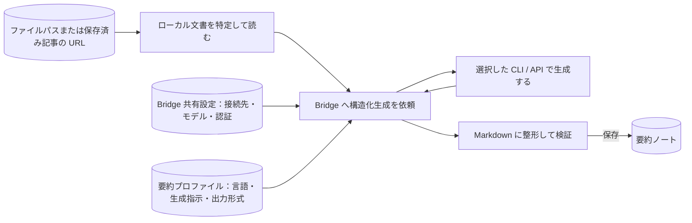

# tkn-doc-summarizer: Tkn Doc Summarizer — ローカル文書を要約ノートにする

ローカルのテキスト文書や、事前に Markdown で保存した Web 記事から、要約・論点・専門用語を整理した Markdown ノートを作る CLI です。
1つの文書の要約、複数ページの記事の統合、複数の記事の比較に使えます。
要約は既定で日本語、設定を変えると英語で作成します。
元の文書への参照と生成条件を記録するため、内容を読み返し、根拠を確認できます。

初めて使う場合は「[セットアップ](#セットアップ)」から「[最初の実行と結果確認](#最初の実行と結果確認)」まで進めてください。
継続して使う場合は「[日常利用と再実行](#日常利用と再実行)」、目的から操作を探す場合は「[コマンド一覧](#コマンド一覧)」を参照してください。

## 得られるノートと対象範囲

次は、バックアップを説明する架空の記事から作る要約ノートの本文例です。
実際の生成結果ではなく、構成を示すために一部の節を抜粋しています。

```markdown
# バックアップと復元確認

## 1. 要約

記事では、バックアップを保存するだけでなく、必要なファイルを復元できることを確認する重要性を説明しています。

## 2. 結論

バックアップの目的は、失ったデータを必要なときに戻せるようにすることです。
保存と復元確認を組み合わせることで、その目的を確かめられます。

## 3. 要点

- 保存の成功と復元の成功は別に確認します。
- 復元する対象と手順を決め、定期的に試します。
```

単一文書と連続ページの要約は「要約 → 結論 → 要点 → 構造（抽象から具体へ）→ 専門用語」の順に並びます。
比較では「比較要約 → 共通概念 → 観点別の捉え方 → 相違・対立 → 各ソース固有の知見 → 専門用語 → 結論」を作り、主張に `[S1, S2]` のような出典 ID を付けます。

| やりたいこと                            | 入力                                                  | 使うコマンド                               |
| --------------------------------------- | ----------------------------------------------------- | ------------------------------------------ |
| 1つの文書を要約する                     | UTF-8 のテキストファイル1件、または保存済み記事の URL | `summarize`                              |
| 連続するページを1つの記事としてまとめる | ページ順に並べた2件以上の文書                         | `synthesize`（既定は `--mode series`） |
| 独立した記事の共通点や違いを整理する    | 比較する2件以上の文書                                 | `synthesize --mode compare`              |

URL は、保存済み Markdown を探す検索キーです。
本 CLI は Web ページを取得しないため、URL を指定する場合は Obsidian Web Clipper などで本文を保存しておきます。
元の文書は読み取り専用で扱い、複製・編集・移動・削除せず、別の要約ノートを作ります。

### 処理の流れ

長方形は処理、円筒形はデータ、矢印はデータの流れです。
CLI が入力の特定、生成の依頼、検証、保存を順に行い、生成AIへの接続は共通ライブラリ [tkn_genai_bridge](https://github.com/tuckn/tkn_genai_bridge)（以下、Bridge）が担当します。



要約プロファイルは、言語・生成指示・出力形式をまとめた設定です。
`default-ja` は日本語、`default-en` は英語を選びます。
生成に使う接続先・モデルは Bridge の共有設定で指定し、アプリの `generation.profiles` から参照します。
要約ノートのほかに、成功・失敗や生成条件を記録した JSON の実行レポートを保存します。

## セットアップ

### 必要なもの

- Python 3.11 以上と [uv](https://docs.astral.sh/uv/)。
- 要約する UTF-8 のテキスト文書と、要約を書き込める保存先。
- 要約に使う CLI または API の利用準備。既定は認証済みの Codex CLI です。

主対象は Windows 11 です。
以下のコマンドはターミナルで実行し、Windows 形式の例示パスを実際のパスに置き換えてください。
他の OS での実動作は未検証です。

### インストールする

リポジトリを置いたフォルダへ移動してインストールします。

```shell
cd "C:\path\to\tkn_doc_summarizer"
uv tool install .
tkn-doc-summarizer --help
tkn-doc-summarizer --version
```

`--help` でコマンド一覧、`--version` でインストール済みのバージョンを確認できます。
更新後の反映方法は「[更新と保守](#更新と保守)」を参照してください。

### 設定ファイルを作成する

```shell
tkn-doc-summarizer config init
```

このコマンドにより、`~/.tkn/doc_summarizer/config.yaml` を作成し、結果の `status` と絶対パス `path` を JSON で表示します。
`~` は実行ユーザーのホームフォルダを示しています。Windows の場合、`C:\Users\<User Name>`です。 同じ内容のファイルがあれば `unchanged` となり、編集済みのファイルがあれば上書きせず停止します。
すでに設定済みの場合は、そのファイルを使って次へ進めます。

### 接続先と保存先を確認する

接続先・モデル・認証は Bridge の共有設定 `~/.tkn/genai_bridge/config.yaml` にまとめます。
共有設定がない場合も組み込みの `codex-default` を利用できます。既定では認証済みの Codex CLI を使います。
本 CLI の設定は `generation.profiles` から Bridge のプロファイルを参照します。

ファイルパスを直接指定する場合、既定の保存先を使えば設定ファイルの編集は不要です。
要約は `~/.tkn/doc_summarizer/data/summaries/`、実行レポートは `~/.tkn/doc_summarizer/state/reports/` に保存します。
URL 入力を使う場合は `source_roots` を保存済み Markdown のフォルダに変更してください。
`config init` の例示パスは実際の検索には使えません。

```shell
tkn-doc-summarizer config list
```

`git config --list` のように、1行ごとの `key=value` で表示します。`values.*` で有効値、`value_sources.*` で設定元、`generationResolved.*` で解決した接続先・モデルなどを確認できます。Windows のパスはそのままコピーできます。
構造化された JSON が必要な場合は `tkn-doc-summarizer config list --json` を使います。
設定例、変更できる項目、優先順位は [設定と生成プロファイル](docs/reference/configuration.md) を参照してください。

## 最初の実行と結果確認

### 入力と保存予定先を確認する

`<source-file>` は、要約する UTF-8 の Markdown またはテキストファイルの実際のパスに置き換えます。
まず `--dry-run` で、入力が読めることと保存予定先を確認します。

```shell
tkn-doc-summarizer summarize "<source-file>" --dry-run
```

新規作成予定なら `status: "planned"` と `path` を表示します。
`--dry-run` は Bridge の `plan()` で接続設定・入力・スキーマを確認し、`details.bridge_plan` に入力ハッシュと token 概算を表示します。
外部 CLI の起動・認証・通信を行わず、要約・レポート・一時ファイルを作成しません。
認証や生成品質までは確認しないため、成功しても実際の生成が成功することを保証しません。

### 要約を作成する

通常実行では、文書の本文とタイトル・出典などを Bridge で選択した接続先へ渡して生成します。
利用形態に応じて利用枠や費用を消費します。
その接続先へ渡せる文書を指定してください。

```shell
tkn-doc-summarizer summarize "<source-file>"
```

生成結果を Markdown に整形し、形式を検証してから保存します。
処理の進捗に続いて、標準出力へ結果の JSON を1件表示します。
次は新規作成時の結果の一部を示す説明例です。

```json
{
  "status": "created",
  "path": "C:\\path\\to\\summaries\\2026\\20260921_バックアップ_default-ja_d5e2d465.md",
  "report_path": "C:\\path\\to\\reports\\20260926T120000+0900_1234abcd.json"
}
```

`status` が `created` または `updated` なら、`path` の要約ノートをエディターや Obsidian で開きます。
既存の要約を再利用した場合は `unchanged` です。
自動検証は構造と出典の一致を確認しますが、要約の意味や事実関係は元の文書と照合してください。
生成直後の確認状態は `reviewStatus: unreviewed` です。

保存後に形式と出典を再確認する場合は、`<summary-note>` を結果の `path` に置き換えて実行します。
この検査は保存時にも自動で行うため、初回実行に必須の追加操作ではありません。

```shell
tkn-doc-summarizer validate "<summary-note>"
```

`valid: true` なら検証成功です。
失敗した場合は `errors` を確認します。
終了コードとレポートの読み方は「[表示と実行レポート](docs/reference/output-and-results.md#表示と実行レポート)」を参照してください。

## 日常利用と再実行

| やりたいこと | コマンド |
| --- | --- |
| 保存済み記事を URL で要約 | `tkn-doc-summarizer summarize "https://example.com/article"` |
| 連続ページを統合 | `tkn-doc-summarizer synthesize "<page-1>" "<page-2>"` |
| 独立した記事を比較 | `tkn-doc-summarizer synthesize "<article-a>" "<article-b>" --mode compare` |
| 英語版を作成 | `tkn-doc-summarizer summarize "<source-file>" --summary-profile default-en` |

URL は `source_roots` に保存済みの記事を探すための検索キーです。Web ページは取得しません。
`synthesize` は入力順序を保持し、比較では出典 ID `S1`、`S2`…を割り当てます。

再実行で入力と生成条件が一致し検証に成功したノートは `unchanged` として再利用します。
変更がある場合は上書きせず停止します。**`--overwrite` は手動編集・確認済み内容を置き換え、`reviewStatus` を `unreviewed` に戻します。**
必要な版を別に保存してから使ってください。

URL 入力の Frontmatter、出典の順序、保存先の変更、再生成と中断時の対応は [日常利用と再実行](docs/guides/operations.md) を参照してください。

## コマンド一覧

| 目的                     | コマンド・主なオプション                          | 詳細                                         |
| ------------------------ | ------------------------------------------------- | -------------------------------------------- |
| 使い方・版を確認         | `--help` / `--version`                        | [インストール](#インストールする)             |
| 1文書を要約              | `summarize SOURCE`                              | [最初の実行](#最初の実行と結果確認)           |
| 連続ページを統合         | `synthesize SOURCE SOURCE [...]`                | [連続ページ](docs/guides/operations.md#連続ページを統合する)      |
| 独立した文書を比較       | `synthesize SOURCE SOURCE [...] --mode compare` | [記事の比較](docs/guides/operations.md#独立した記事を比較する)         |
| 保存済みノートを検証     | `validate PATH`                                 | [ノートの検証](docs/guides/maintenance.md#保存済みノートを検証する) |
| ユーザー設定を作成       | `config init`                                   | [設定ファイルの作成](#設定ファイルを作成する) |
| 有効な設定と決定元を確認 | `config list`                                   | [設定](#設定)                                 |
| 設定を初期状態へ戻す     | `config init --force`                           | [設定の初期化](docs/guides/maintenance.md#設定を初期状態へ戻す)         |
| 編集用の生成指示を作成   | `prompt init [NAME]`                            | [カスタムプロンプト](docs/reference/configuration.md#カスタム生成指示)     |

表のコマンドの前に `tkn-doc-summarizer` を付けて実行します。
各コマンドの全オプションは、例えば `tkn-doc-summarizer summarize --help` で確認できます。

### 共通オプションと書き込み範囲

`summarize`、`synthesize`、`config list` の設定上書きはコマンド名の後ろに指定します。
`--source-root`、`--model`、`--config`、`--reports-root` などはその実行だけに適用されます。
通常の生成・再利用・dry-run と各補助コマンドの書き込み範囲は [保存先、結果、対応範囲](docs/reference/output-and-results.md#書き込み範囲) の表を参照してください。

## 設定

設定は組み込み値、ユーザー設定 `~/.tkn/doc_summarizer/config.yaml`、作業フォルダの `./.tkn/config.yaml`、`--config`、コマンドオプションの順に上書きします。
`config list` の `values.*` と `value_sources.*` で有効値と決定元を確認できます。
接続先・モデル・認証は Bridge の共有設定で管理し、アプリ設定からプロファイル名で参照します。

設定キーの一覧、既定値、パスの扱い、生成プロファイル、カスタム生成指示は [設定と生成プロファイル](docs/reference/configuration.md) を参照してください。

## 保存されるものと形式

既定では要約ノートを `~/.tkn/doc_summarizer/data/summaries/`、JSON 実行レポートを `~/.tkn/doc_summarizer/state/reports/` に保存します。
要約ノートには出典と生成条件の Frontmatter、本文、確認状態を記録します。
形式は単一文書が `schemaVersion: "8.0"`、連続ページが `"9.0"`、比較が `"7.0"` です。

- [要約ノートの形式](docs/reference/note-format.md)：Frontmatter の YAML 例、形式別の全項目、本文の構成。
- [保存先、結果、対応範囲](docs/reference/output-and-results.md)：保存場所、識別条件、JSON レポート、終了コード。

## 対応範囲と制限

入力は UTF-8 のテキストファイルか、ローカルに Markdown として保存済みの記事です。
PDF・Word・画像からの本文抽出、未保存 Web ページの取得、長文の段階的な分割要約、フォルダ一括処理は行いません。
生成結果の意味や事実関係は自動検証できないため、元文書と照合してください。
対応する接続先、サイズ上限、実行単位の詳細は [保存先、結果、対応範囲](docs/reference/output-and-results.md#対応範囲と制限) を参照してください。

## 更新と保守

リポジトリ更新後は、インストール済み CLI へ変更を反映します。

```shell
cd "C:\path\to\tkn_doc_summarizer"
uv tool install . --reinstall
tkn-doc-summarizer --version
```

保存済みノートの検証、設定の初期化、再インストール時の注意は [更新と開発](docs/guides/maintenance.md) を参照してください。

## 開発と検証

開発環境の準備、テスト、editable インストール、同梱プロファイルの変更方法は [更新と開発](docs/guides/maintenance.md#開発環境を用意する) を参照してください。

## 関連資料

- [日常利用と再実行](docs/guides/operations.md)：URL 入力、統合・比較、再生成と中断時の対応。
- [設定と生成プロファイル](docs/reference/configuration.md)：設定キー、優先順位、接続先、カスタム指示。
- [要約ノートの形式](docs/reference/note-format.md)：Frontmatter と本文の形式別一覧。
- [保存先、結果、対応範囲](docs/reference/output-and-results.md)：実行結果とレポートの読み方。
- [更新と開発](docs/guides/maintenance.md)：再インストール、検証、開発時の操作。
- [設定例](src/doc_summarizer/resources/config.example.yaml)：`config init` が作成する全項目。
- [日本語の要約指示](src/doc_summarizer/summary_profiles/default-ja/prompt.md)／[英語の要約指示](src/doc_summarizer/summary_profiles/default-en/prompt.md)：単一文書と連続ページの要約方針。
- [日本語の比較指示](src/doc_summarizer/comparison_profiles/default-ja/prompt.md)／[英語の比較指示](src/doc_summarizer/comparison_profiles/default-en/prompt.md)：出典を付けた比較の方針。
- [CLI の定義](src/doc_summarizer/cli.py)：コマンドと引数。
- [ノートの検証](src/doc_summarizer/validation.py)：保存済みノートの形式・出典の検査。
- [テスト](tests/)：人工データによる動作確認。
- [MIT License](LICENSE)。

変更履歴と既存コマンドからの移行方法は [CHANGELOG](CHANGELOG.md) を参照してください。
